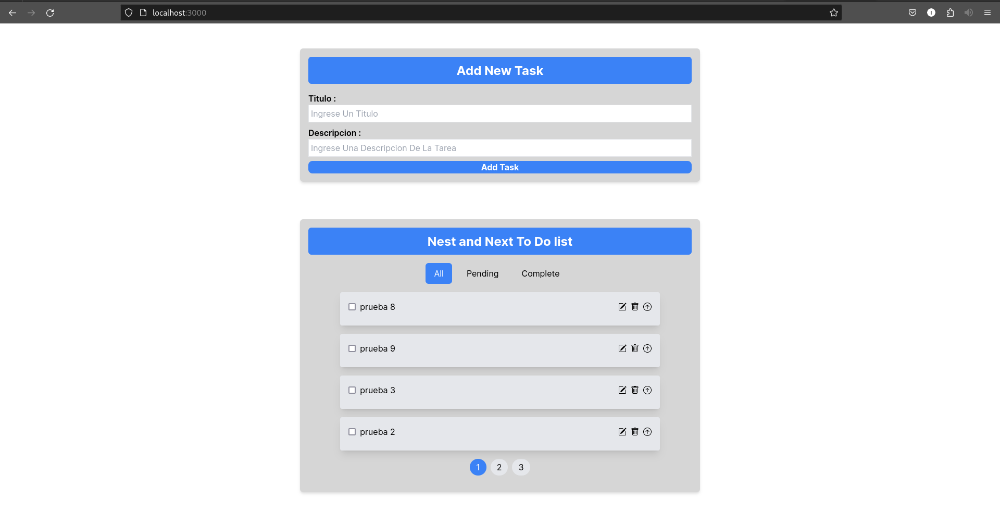
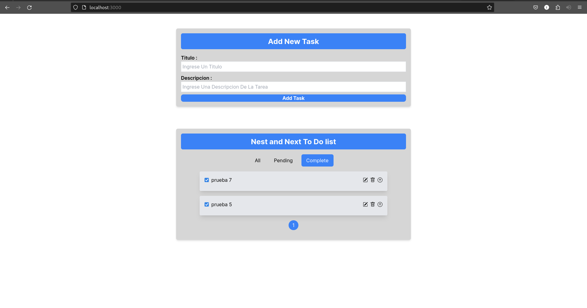
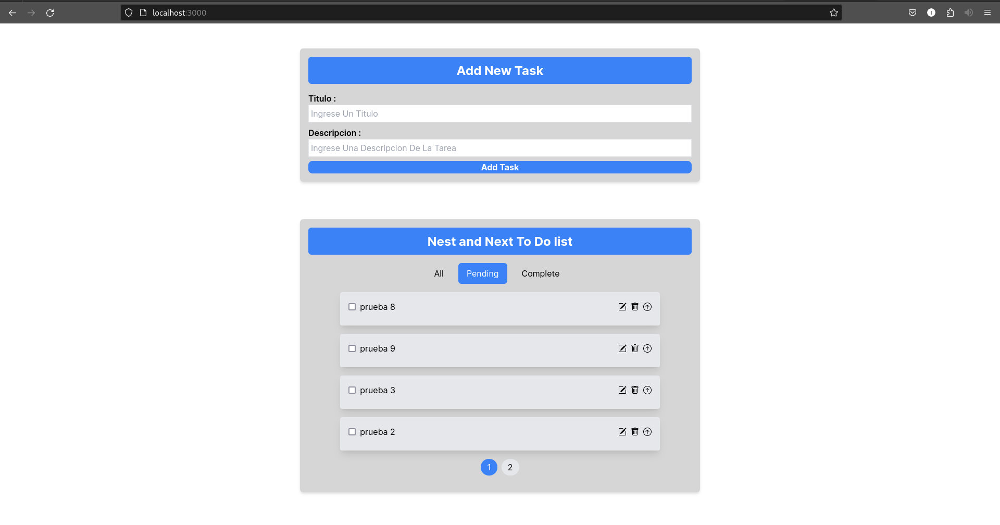
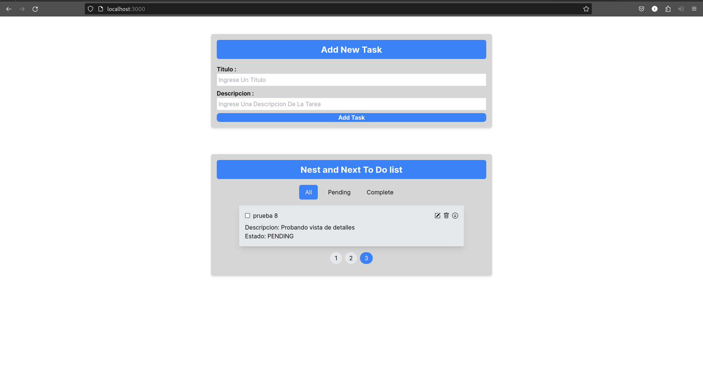
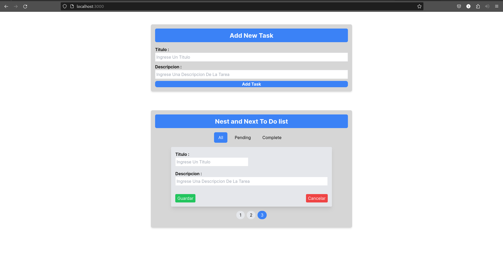

# Next.JS-And-Nest.JS-To-Do-List
Mono Repo For My Practice Project with next.js and nest.js
## Original Repos

 - [Frontend Repo](https://github.com/noahpark24/Next.js-to-do-list)

 - [Api Repo](https://github.com/noahpark24/nest.js-to-do-list)

## Capturas Del Proyecto :
||||||
